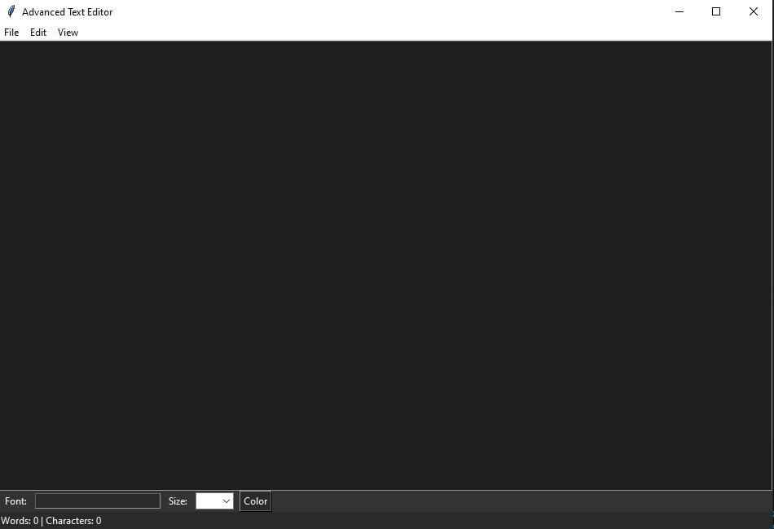

## TextCraft
A powerful, single-file text editor with advanced features like font search, word count, dark mode, and multi-tab support.

## Features
- Font Types
- Font Colors
- Character Count
- Word Count
- Dark/Light Mode Toggle

## Demo

## How to run
`python main.py`

## Technologies
- Python 3
- Tkinter

## LICENSE
This project is licensed under the MIT License